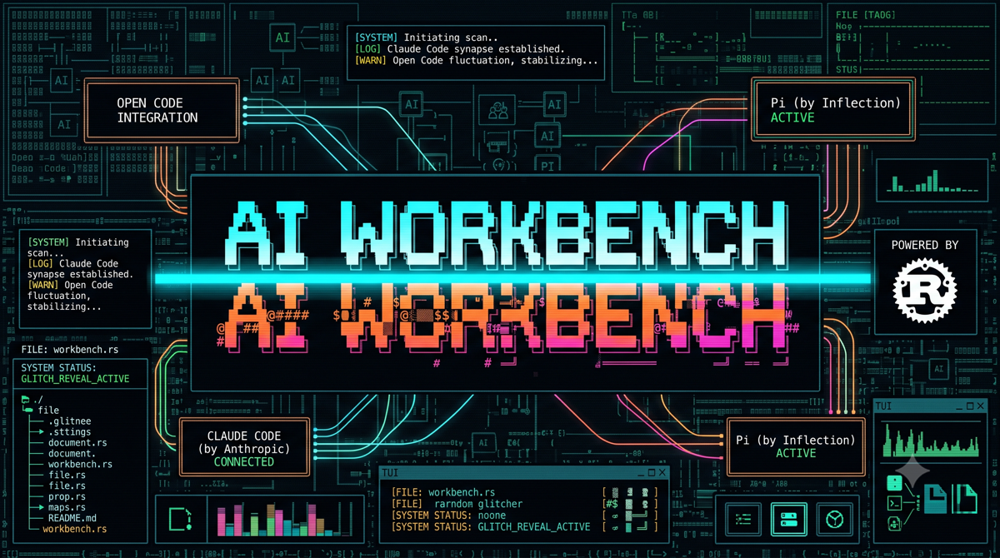

# AI Workbench

<p align="center">
  
</p>

**[English](#english) | [Deutsch](#deutsch)**

---

<a name="english"></a>
## English

A Rust-based TUI (Terminal User Interface) multiplexer designed for AI-assisted development workflows. Provides an integrated development environment with file browser, syntax-highlighted preview pane, and multiple embedded PTY terminals.

The primary (AI) pane is **backend-selectable** — launch it with Claude Code, OpenCode, or Pi via a single startup argument (`ai-workbench claude|opencode|pi`). The chosen backend is remembered across runs; every other pane stays identical.


### Built for Speed. Stripped to the Essentials.

I love efficient coding, but I grew tired of bloated IDEs. Visual Studio Code felt too heavy, and other tools often came with baggage I simply didn't need for my daily workflow. What I truly wanted was an environment as fast as my thought process — built on the stability of Rust and bringing the power of Claude directly into the shell.

Over the 2025/2026 New Year, I turned that vision into reality: **AI Workbench**.

It's not a traditional IDE; it's a high-performance TUI (Terminal User Interface). Built on the Fish shell and Rust, it seamlessly integrates tools like `lazy-git` and provides everything you need for a frictionless workflow — from an intelligent file browser and live Markdown rendering to direct Claude integration.

No overhead. Maximum performance. Built by a developer, for developers.

#### Why Start Fresh?

- **The Problem:** Modern IDEs have become bloated, filled with features that distract rather than help.
- **The Search:** After testing alternatives like Zed or Google IDX, they lacked the "Shell-First" philosophy I crave.
- **The Goal:** Create a portable, lightning-fast solution that feels like a natural extension of the terminal.

#### The Technical Foundation

- **Rust:** Chosen for uncompromising performance, safety, and stability.
- **Fish Shell (4.x):** The core for a modern, user-friendly command-line experience.
- **Claude Integration:** Deep integration of Claude (e.g., via Claude Code) for AI-assisted development without leaving the terminal.
- **Automation:** Hosted on GitHub with automated release workflows (compiling) and integrated self-update logic.

### Features

| Pane | Key | Description |
|------|-----|-------------|
| **File Browser** | F1 | Navigate directories, git status integration, file operations (F9), toggle visibility |
| **Preview** | F2 | Syntax highlighting (500+ languages), Markdown rendering, built-in editor |
| **AI Agent** | F4 | Embedded AI CLI — Claude Code, OpenCode, or Pi (selected at launch); Claude mode adds startup prefixes |
| **LazyGit** | F5 | Integrated Git TUI (restarts in current directory) |
| **Terminal** | F6 | General-purpose shell (syncs to current directory) |

### AI Backends

AI Workbench drives one AI coding agent in its primary pane, chosen with a positional launch argument:

```bash
ai-workbench claude     # Anthropic Claude Code CLI (default)
ai-workbench opencode   # OpenCode CLI
ai-workbench pi         # Pi CLI
```

- The backend name is case-insensitive; an unknown value exits with an error.
- Without an argument, the **last-used backend is resumed** (first-run default: `claude`), persisted to `~/.config/ai-workbench/session.yaml`.
- **Switch the backend at runtime with `F8`** — it cycles Claude → OpenCode → Pi, respawns the AI pane, and persists the choice. (`Shift+F8` opens Settings.)
- Each backend's command is configurable via `pty.claude_command` / `pty.opencode_command` / `pty.pi_command`. The **OpenCode** and **Pi** commands take a full command line with arguments — e.g. `opencode --model glm-5.2:cloud` — and are editable in **Settings (Shift+F8) → Paths** ("OpenCode Command" / "Pi Command") as well as in `config.yaml`:
  ```yaml
  pty:
    opencode_command: ["opencode", "--model", "glm-5.2:cloud"]
    pi_command: ["pi"]
  ```
- Claude-specific flags (permission mode, model, effort, session, worktree) and the permission/startup dialogs apply **only** in Claude mode. The Model options `Fable`/`Opus`/`Sonnet`/`Haiku` map to the CLI `--model` aliases (always newest of each tier).
- The first-run wizard checks all three CLIs, lets you set each path, and pick the default backend.

**Highlights:**
- Full PTY emulation with 256-color support and 1000-line scrollback
- Search & Replace (MC Edit style) with regex support
- **Character-level mouse selection** - click and drag to select text, auto-copies to clipboard
- Keyboard selection mode (Ctrl+S) with intelligent filtering
- Drag & Drop files into terminals
- Git remote change detection with pull prompts
- Claude fullscreen mode when all panes hidden (F1/F2/F5/F6 toggles)
- **Interactive pane resizing** - drag pane borders with mouse
- **Horizontal scrolling** - in Preview and Edit mode for long lines
- **F9 Copy Output** - in the Terminal pane copies the whole last command block from the full scrollback; in Claude/LazyGit copies the last N visible lines (configurable, default 50)
- **Self-update** - automatic update check from GitHub Releases
- **App Dropdown** - auto-detect installed browsers/editors in Settings (macOS + Linux)
- **Ctrl+X Markdown Export** - export as Markdown copy or PDF (native Typst engine, no external tools needed)
- **Ctrl+V Paste** - clipboard paste in all input dialogs
- Mouse and keyboard navigation throughout

### Quick Start

```bash
# Install via Homebrew (macOS / Linux)
brew install eqms/ai-workbench/ai-workbench

# Or use the installer script
curl -fsSL https://raw.githubusercontent.com/eqms/ai-workbench/main/scripts/install.sh | bash

# Or build from source
git clone https://github.com/eqms/ai-workbench.git
cd ai-workbench && cargo build --release
./target/release/ai-workbench
```

**See [INSTALL.md](INSTALL.md) for detailed platform-specific installation instructions.**

### Essential Shortcuts

| Key | Action |
|-----|--------|
| F1-F6 | Switch between panes |
| F9 | File menu in File Browser / **Copy last command block** (Terminal) or **last N lines** (Claude, LazyGit) to clipboard |
| F12 | Help (full shortcut reference) |
| Ctrl+P | Fuzzy file finder |
| Ctrl+Q | Quit |
| E | Edit file (in Preview) |
| Ctrl+X | Export Markdown/PDF (format chooser) |
| Shift+F2 | Open in External Editor (context-aware) |
| Ctrl+S | Selection mode (in Terminal/Preview) |
| Ctrl+C | Copy selection to System Clipboard |
| F11 | Universal Paste — inject system clipboard into active pane (XRDP / broken bracketed-paste workaround) |
| Right-click | Paste from system clipboard into pane under cursor (mirrors Kitty's `mouse_map right press paste`) |

**See [USAGE.md](USAGE.md) for complete keyboard shortcuts and detailed usage guide.**

### What's New

AI Workbench is versioned from **v1.0.0** onward. For the full, up-to-date changelog — including the latest release — see **[RELEASE_NOTES.md](RELEASE_NOTES.md)**.

### Configuration

Configuration files are loaded in priority order:
1. `./config.yaml` (project-local, highest priority)
2. `~/.config/ai-workbench/config.yaml` (user config)

```yaml
terminal:
  shell_path: "/opt/homebrew/bin/fish"
  shell_args: ["-l"]

ui:
  theme: "default"
  intro_animation: true   # startup Glitch & Scanline Reveal intro (false to skip)

layout:
  claude_height_percent: 40
  file_browser_width_percent: 20
  preview_width_percent: 50
  right_panel_width_percent: 30

file_browser:
  show_hidden: false
  show_file_info: true
  date_format: "%d.%m.%Y %H:%M:%S"
  auto_refresh_ms: 2000

# Optional: Claude startup prefixes and remote control
claude:
  remote_control: false  # Auto-show QR code for remote access after start
  startup_prefixes:
    - name: "Code Review"
      prefix: "/review"
      description: "Review code changes"

# Document export settings (PDF uses native Typst, no external tools needed)
document:
  company:
    name: "My Company"                    # Shown in PDF footer and author
    footer_text: "Generated by {company_name}"
  fonts:
    body: "Calibri, -apple-system, sans-serif"
  colors:
    table_header_bg: "#D5E8F0"
  pdf:
    page_size: "A4"
    margin: "2.5cm"          # uniform fallback for all sides
    # Optional per-side overrides (empty → use `margin`):
    margin_top: ""
    margin_right: ""
    margin_bottom: ""
    margin_left: ""
```

> **Page margins** are editable in the TUI under **F8 → Document**. `Page Margin
> (all sides)` sets a uniform margin; the four `Margin Top/Right/Bottom/Left`
> fields override individual sides (leave empty to inherit the uniform value).
> Narrower left/right margins give wide tables more room.

### Tech Stack

- **[Ratatui](https://github.com/ratatui/ratatui)** - TUI framework
- **[Crossterm](https://github.com/crossterm-rs/crossterm)** - Terminal handling
- **[portable-pty](https://github.com/wez/wezterm)** - PTY management
- **[vt100](https://github.com/doy/vt100-rust)** - Terminal emulation
- **[syntect](https://github.com/trishume/syntect)** - Syntax highlighting
- **[Typst](https://github.com/typst/typst)** - Native PDF generation (pure Rust, no external binaries)
- **[tui-textarea](https://github.com/rhysd/tui-textarea)** - Text editor widget
- **[tui-markdown](https://github.com/joshka/tui-markdown)** - Markdown rendering

### License

MIT License - Copyright (c) 2025 Martin Schmid

See [LICENSE](LICENSE) for details.

---

<a name="deutsch"></a>
## Deutsch

Ein Rust-basierter TUI (Terminal User Interface) Multiplexer für KI-unterstützte Entwicklungsworkflows. Bietet eine integrierte Entwicklungsumgebung mit Dateibrowser, Syntax-hervorgehobener Vorschau und mehreren eingebetteten PTY-Terminals.

### Gebaut für Geschwindigkeit. Reduziert auf das Wesentliche.

Ich liebe effizientes Programmieren, aber ich hatte genug von aufgeblähten IDEs. Visual Studio Code fühlte sich zu schwer an, und andere Tools brachten oft Ballast mit, den ich für meinen täglichen Workflow schlicht nicht brauchte. Was ich wirklich wollte, war eine Umgebung, die so schnell ist wie mein Denkprozess — aufgebaut auf der Stabilität von Rust und mit der Kraft von Claude direkt in der Shell.

Über Silvester 2025/2026 habe ich diese Vision Wirklichkeit werden lassen: **AI Workbench**.

Es ist keine traditionelle IDE; es ist ein hochperformantes TUI (Terminal User Interface). Aufgebaut auf der Fish Shell und Rust, integriert es nahtlos Werkzeuge wie `lazy-git` und bietet alles, was man für einen reibungslosen Workflow braucht — von einem intelligenten Dateibrowser und Live-Markdown-Rendering bis hin zur direkten Claude-Integration.

Kein Overhead. Maximale Performance. Von einem Entwickler, für Entwickler.

#### Warum von Grund auf neu?

- **Das Problem:** Moderne IDEs sind aufgebläht, vollgestopft mit Features die ablenken statt zu helfen.
- **Die Suche:** Nach dem Testen von Alternativen wie Zed oder Google IDX fehlte ihnen die "Shell-First"-Philosophie, die ich brauche.
- **Das Ziel:** Eine portable, blitzschnelle Lösung schaffen, die sich wie eine natürliche Erweiterung des Terminals anfühlt.

#### Das technische Fundament

- **Rust:** Gewählt für kompromisslose Performance, Sicherheit und Stabilität.
- **Fish Shell (4.x):** Der Kern für ein modernes, benutzerfreundliches Kommandozeilen-Erlebnis.
- **Claude-Integration:** Tiefe Integration von Claude (z.B. via Claude Code) für KI-unterstützte Entwicklung ohne das Terminal zu verlassen.
- **Automatisierung:** Gehostet auf GitHub mit automatisierten Release-Workflows (Kompilierung) und integrierter Selbst-Update-Logik.

### Funktionen

| Bereich | Taste | Beschreibung |
|---------|-------|--------------|
| **Dateibrowser** | F1 | Verzeichnisnavigation, Git-Status-Integration, Dateioperationen (F9), ein-/ausblenden |
| **Vorschau** | F2 | Syntax-Hervorhebung (500+ Sprachen), Markdown-Rendering, Editor |
| **AI-Agent** | F4 | Eingebettetes AI-CLI — Claude Code, OpenCode oder Pi (beim Start gewählt); im Claude-Modus mit Startup-Präfixen |
| **LazyGit** | F5 | Integrierte Git-TUI (startet im aktuellen Verzeichnis neu) |
| **Terminal** | F6 | Allgemeines Shell-Terminal (wechselt ins aktuelle Verzeichnis) |

### AI-Backends

AI Workbench betreibt im primären Panel einen AI-Coding-Agenten, der per Startparameter gewählt wird:

```bash
ai-workbench claude     # Anthropic Claude Code CLI (Standard)
ai-workbench opencode   # OpenCode CLI
ai-workbench pi         # Pi CLI
```

- Der Backend-Name ist case-insensitiv; ein unbekannter Wert beendet mit Fehler.
- Ohne Parameter wird das **zuletzt genutzte Backend fortgesetzt** (Standard beim ersten Start: `claude`), gespeichert in `~/.config/ai-workbench/session.yaml`.
- Jedes Backend-Kommando ist über `pty.claude_command` / `pty.opencode_command` / `pty.pi_command` konfigurierbar.
- Claude-spezifische Flags (Permission-Mode, Model, Effort, Session, Worktree, Remote-Control) sowie die Permission-/Startup-Dialoge greifen **nur** im Claude-Modus.
- Der Ersteinrichtungs-Assistent prüft alle drei CLIs, lässt jeden Pfad setzen und das Standard-Backend wählen.

**Highlights:**
- Volle PTY-Emulation mit 256-Farben und 1000 Zeilen Scrollback
- Suchen & Ersetzen (MC Edit Stil) mit Regex-Unterstützung
- **Zeichenweise Mausauswahl** - Klicken und Ziehen zum Markieren, kopiert automatisch ins Clipboard
- Tastatur-Auswahlmodus (Ctrl+S) mit intelligentem Filtering
- Drag & Drop von Dateien in Terminals
- Git Remote-Änderungserkennung mit Pull-Aufforderung
- Claude Vollbildmodus wenn alle Bereiche ausgeblendet (F1/F2/F5/F6 Umschaltung)
- **Interaktives Pane-Resizing** - Bereichsgrenzen per Maus ziehen
- **Horizontales Scrollen** - in Vorschau und Editor für lange Zeilen
- **F9 Ausgabe kopieren** - im Terminal-Bereich kopiert den ganzen letzten Kommando-Block aus dem vollen Scrollback; in Claude/LazyGit die letzten N sichtbaren Zeilen (konfigurierbar, Standard 50)
- **Selbst-Update** - automatische Update-Prüfung von GitHub Releases
- **App-Dropdown** - automatische Erkennung installierter Browser/Editoren in Settings (macOS + Linux)
- **Ctrl+X Markdown-Export** - Export als Markdown-Kopie oder PDF (native Typst-Engine, keine externen Tools nötig)
- **Ctrl+V Einfügen** - Clipboard-Paste in allen Eingabedialogen
- Maus- und Tastaturnavigation durchgehend

### Schnellstart

```bash
# Installation via Homebrew (macOS / Linux)
brew install eqms/ai-workbench/ai-workbench

# Oder Installer-Skript verwenden
curl -fsSL https://raw.githubusercontent.com/eqms/ai-workbench/main/scripts/install.sh | bash

# Oder aus Quellcode bauen
git clone https://github.com/eqms/ai-workbench.git
cd ai-workbench && cargo build --release
./target/release/ai-workbench
```

**Siehe [INSTALL.md](INSTALL.md) für detaillierte plattformspezifische Installationsanleitungen.**

### Wichtige Tastenkürzel

| Taste | Aktion |
|-------|--------|
| F1-F6 | Zwischen Bereichen wechseln |
| F9 | Datei-Menü im Dateibrowser / **Letzten Kommando-Block kopieren** (Terminal) bzw. **letzte N Zeilen** (Claude, LazyGit) ins Clipboard |
| F12 | Hilfe (vollständige Shortcut-Referenz) |
| Ctrl+P | Fuzzy-Dateisuche |
| Ctrl+Q | Beenden |
| E | Datei bearbeiten (in Vorschau) |
| Ctrl+X | Markdown/PDF exportieren (Format-Auswahl) |
| Shift+F2 | In externem Editor öffnen (kontextabhängig) |
| Ctrl+S | Auswahlmodus (in Terminal/Vorschau) |
| Ctrl+C | Auswahl in System-Clipboard kopieren |
| F11 | Universal Paste — System-Clipboard in aktive Pane einfügen (Workaround für XRDP / defektes Bracketed-Paste-Forwarding) |
| Rechtsklick | Paste aus System-Clipboard in Pane unter dem Cursor (entspricht Kittys `mouse_map right press paste`) |

**Siehe [USAGE.md](USAGE.md) für alle Tastenkürzel und detaillierte Bedienungsanleitung.**

### Was ist neu

AI Workbench wird ab **v1.0.0** versioniert. Den vollständigen, aktuellen Changelog — inklusive des neuesten Releases — findest du in **[RELEASE_NOTES.md](RELEASE_NOTES.md)**.

### Konfiguration

Konfigurationsdateien werden in Prioritätsreihenfolge geladen:
1. `./config.yaml` (projektlokal, höchste Priorität)
2. `~/.config/ai-workbench/config.yaml` (Benutzerkonfiguration)

```yaml
terminal:
  shell_path: "/opt/homebrew/bin/fish"
  shell_args: ["-l"]

ui:
  theme: "default"
  intro_animation: true   # startup Glitch & Scanline Reveal intro (false to skip)

layout:
  claude_height_percent: 40
  file_browser_width_percent: 20
  preview_width_percent: 50
  right_panel_width_percent: 30

file_browser:
  show_hidden: false
  show_file_info: true
  date_format: "%d.%m.%Y %H:%M:%S"
  auto_refresh_ms: 2000

# Optional: Claude Startup-Präfixe und Remote Control
claude:
  remote_control: false  # QR-Code für Remote-Zugriff automatisch anzeigen
  startup_prefixes:
    - name: "Code Review"
      prefix: "/review"
      description: "Code-Änderungen überprüfen"
```

### Technologie-Stack

- **[Ratatui](https://github.com/ratatui/ratatui)** - TUI-Framework
- **[Crossterm](https://github.com/crossterm-rs/crossterm)** - Terminal-Handhabung
- **[portable-pty](https://github.com/wez/wezterm)** - PTY-Verwaltung
- **[vt100](https://github.com/doy/vt100-rust)** - Terminal-Emulation
- **[syntect](https://github.com/trishume/syntect)** - Syntax-Hervorhebung
- **[tui-textarea](https://github.com/rhysd/tui-textarea)** - Texteditor-Widget
- **[tui-markdown](https://github.com/joshka/tui-markdown)** - Markdown-Rendering

### Lizenz

MIT-Lizenz - Copyright (c) 2025 Martin Schmid

Siehe [LICENSE](LICENSE) für Details.
